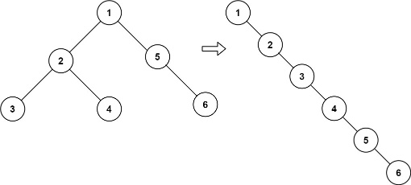

Code: [Flatten Binary Tree to Linked List.py](../../Solutions/Top%20100%20liked/Flatten%20Binary%20Tree%20to%20Linked%20List.py)
# Example : 
>```python
> root = [1,2,5,3,4,None,6]
> # >>> [1,None,2,None,3,None,4,None,5,None,6]
>```
> 

---
### 1. Start from `root = 1`, go right:
- Call `revPreOrder(5)`

### 2. `revPreOrder(5)`
- Call `revPreOrder(6)`
    - No children, process:
      - `node.left = None`
      - `node.right = head (None)`
      - `head = 6`
- Back to 5:
    - No left
    - Process 5:
      - `node.left = None`
      - `node.right = head (6)`
      - `head = 5`

### 3. Back to root `1`, go left → `revPreOrder(2)`
- Call `revPreOrder(4)`
    - No children, process:
      - `node.right = head (5)`
      - `head = 4`
- Call `revPreOrder(3)`
    - No children, process:
      - `node.right = head (4)`
      - `head = 3`
- Back to 2:
    - Process 2:
      - `node.right = head (3)`
      - `head = 2`

### 4. Back to root `1`:
- Process 1:
  - `node.right = head (2)`
  - `head = 1`
---

```bash
revPreOrder(1)
├── revPreOrder(5)
│   ├── revPreOrder(6)
│   │   └── head = 6
│   └── 5.right = head (=6), head = 5
├── revPreOrder(2)
│   ├── revPreOrder(4)
│   │   └── 4.right = head (=5), head = 4
│   ├── revPreOrder(3)
│   │   └── 3.right = head (=4), head = 3
│   └── 2.right = head (=3), head = 2
│
└── 1.right = head (=2), head = 1
```